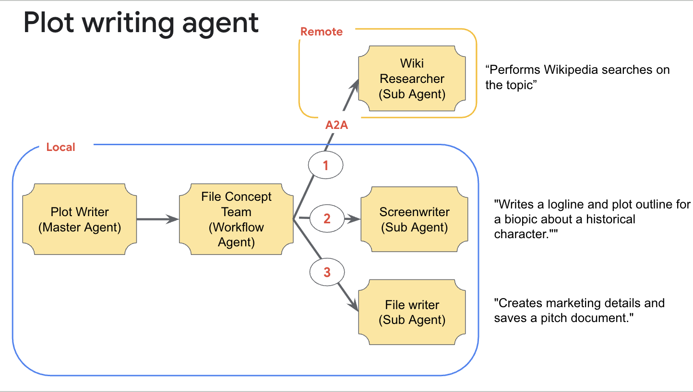

# Description
AI Agents built with ADK with A2A. The Plotwriter agent is an orchestrator of 4 sub agents, one of which is a remote A2A capable agent. Plotwriter creates a movie plot from user input on a historical figure. The remote A2A agent is the wiki researcher that performs wikipedia searches on the topic and returns results to Plotwriter. All other sub agents are locally integrated within Plotwriter agent.py code.




# Deployemnt
These agents can be deloyed on both Agent Engine or GKE

## Agent Engine
Run the following CLI commands from the root directory of each agent.

```bash
cd plotwriter

adk deploy agent_engine --project [YOUR PROJECT NAME] --region [REGION] movie_plotwriter

cd researcher

adk deploy agent_engine --project [YOUR PROJECT NAME] --region [REGION] wiki_researcher
```

## GKE

### Pre-requisits
The Deployment.yaml creates a Gateway API that serves traffic on ports 80 and 443. As such, it expects a certificate to be pre-existing along with a registered domain in cloud DNS that is linked to the certificate and an external static IP. For this demo to work in your environment, create/register your own domain and certificate and update Deployment.yaml 

### Build & push container images
```bash
cd researcher

docker build --platform linux/amd64 -t [REGION]-docker.pkg.dev/[GCP-PROJECT-ID]/[REPO-NAME]/researcher-agent:latest .

docker push [REGION]-docker.pkg.dev/[GCP-PROJECT-ID]/[REPO-NAME]/researcher-agent:latest

cd plotwriter

docker build --platform linux/amd64 -t [REGION]-docker.pkg.dev/[GCP-PROJECT-ID]/[REPO-NAME]/plotwriter-agent:latest .

docker push [REGION]-docker.pkg.dev/[GCP-PROJECT-ID]/[REPO-NAME]/plotwriter-agent:latest

```

### Create Kubernetes service accounts
```bash
./plotwriter/K8s/create-service-account.sh
./researcher/K8s/create-service-account.sh
```

### Create Kubernetes config map for env variables for agents
```bash
kubectl create configmap agent-config \
  --from-literal=PORT=8080 \
  --from-literal=GOOGLE_CLOUD_PROJECT="YOUR PROJECT ID" \
  --from-literal=PLOTWRITER_API_URL="https://[YOUR DOMAIN]/plotwriter" \
  --from-literal=RESEARCHER_API_URL="https://[YOUR DOMAIN]/researcher" \
  --from-literal=GOOGLE_CLOUD_LOCATION="YOUR REGION" \
  --from-literal=GOOGLE_GENAI_USE_VERTEXAI="true" \
  --from-literal=MODEL="gemini-2.5-flash"
```

### Deploy to GKE 
(run it from the project root directory)
```bash
# 1. Export the environment variables
export PLOTWRITER_IMAGE="[YOUR-REGION]-docker.pkg.dev/[YOUR PROJECT ID]/[YOUR REPO]/plotwriter-agent:latest"
export RESEARCHER_IMAGE="[YOUR-REGION]-docker.pkg.dev/[YOUR PROJECT ID]/[YOUR REPO]/researcher-agent:latest"
export STATIC_IP_NAME="[YOUR STATIC IP NAME]"
export CERT_MAP_NAME="[YOUR CERT MAP NAME]"

envsubst < Deployment.yaml | kubectl apply -f -

```
